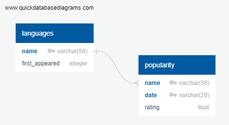

# ETL Demo
Get a list of programming languages and when they were first intoduced and append popularity information to those languages.
## Requirements
| Python Modules | Usage |
| ------ | ------ |
| lxml | html parser |
| requests | make a request to a web page |
| time | add delays to workflows |
| pymongo | access MongoDB server |
| pickle | [serialization](https://en.wikipedia.org/wiki/Serialization) for saving/loading data structures as files |
| sqlalchemy | orm for databases |
| psycopg2 | access postgresql server |
Project assumes the following is installed:
* Python 3.8 or above (needed for the [Walrus Operator](https://www.geeksforgeeks.org/walrus-operator-in-python-3-8/#:~:text=Walrus%2Doperator%20is%20another%20name%20for%20assignment%20expressions.&text=The%20Assignment%20expressions%20allow%20a,as%20a%20stand%2Dalone%20statement.))
* MongoDB
* Postgresql

## Workflow

### [wiki](https://en.wikipedia.org/wiki/List_of_programming_languages)

#### *extract*
1. scrape the programming languages wiki for all links
2. visit each link
3. get the html contents from each link
4. store the contents of the html and coresponding link in MongoDB

Notes
* In case repeated runs need to be performed check MongoDB if the link that needs to be visited has already been visited if it has skip the request to prevent unessassary bandwidth use
* Since a simple "get all links" is used there will be an excess of invalid html data
* Any step where a request or insert fails the data will be skipped
* Add a 1 second delay if html contents are downloaded

#### *transform* 
1. exclude html content that does not include
    1. "programming language"
    2. the word "First"
    3. the word "appeared"
    4. the id "firstHeading"
    5. the td containing the year "First appeared"
2. exclude dates outside the format of year
3. from pulled name and date create a list of dictionaries to store the data
4. save the stored data as a file for the load process

Notes
* exclusion of valid programming languages from inital criteria may occur

#### *load*
1. load the stored data from the transform process
2. insert the data into the languages table in postgres
3. skip any data that fails to insert

Notes
* A one liner could have been used to turn the data into a Pandas data frame then have that dataframe automagically insert the data into the database, this option was not used for performance and overhead reasons

### [kagle csv](https://www.kaggle.com/muhammadkhalid/most-popular-programming-languages-since-2004)

#### *extract*

1. download csv (manual step)
2. load csv

#### *transform*

1. reformat data
    * input: row - date, rating | column - date, programming language
    * output: tuple (date, programming language, rating)
2. cast rating into a float
3. flatten name

#### *load*

1. check if the pending ratings' programming language is in the database
2. if the programming language exists - insert
3. if the programming language does not exist - append to missing programming languages list

Notes
* Since the posibility of a rated programming language not existing in the database exists refinement to the wiki ETL may be needed else perform manual entry of missing languages
* Data failing to flatten or be inserted is skipped

## Postgresql Schema

Notes
* Better constraints can be applied by using the date datatype for the first_appeared and date fields
